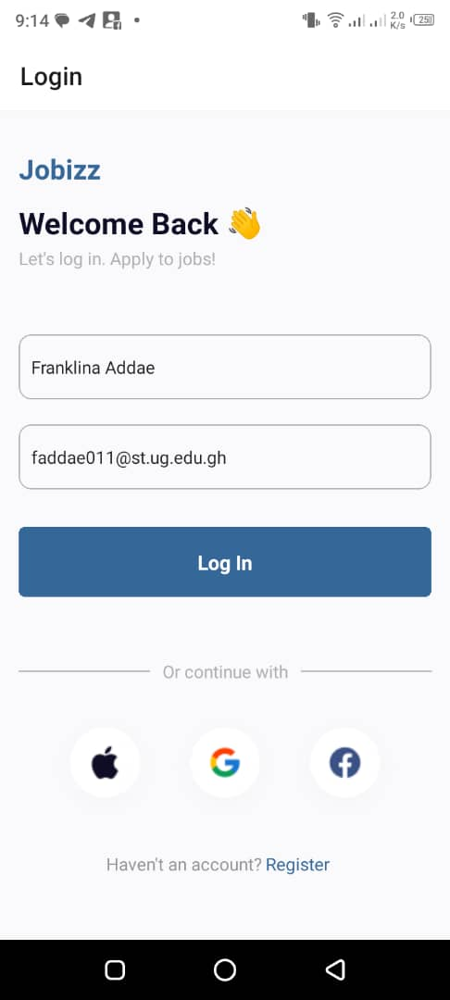

# rn-assignment4

## Description

This project is a simple R veact Native application that demonstrates a basic UI with a Login page and a Homepage. The project showcases fundamental React Native components and navigation using React Navigation.

## Components

### 1. `LoginScreen`

- **Usage**: This is the initial screen of the app where users can log in by entering their name and email. The user can also choose to continue with Apple, Google, or Facebook. Upon successful login, the user is navigated to the Homepage.
- **Props**: 
  - `navigation`: Navigation prop from React Navigation to handle navigation between screens.
- **State**:
  - `name`: Stores the user's name.
  - `email`: Stores the user's email.
- **Functions**:
  - `handleLogin`: Navigates the user to the Homepage screen with the entered name and email as parameters.

### 2. `HomeScreen`

- **Usage**: This screen displays the user's name and email along with lists of featured and popular job listings. Users can search for jobs using a search bar at the top.
- **Props**:
  - `route`: Route prop from React Navigation to access the parameters passed from the LoginScreen.
- **State**: None
- **Functions**: None

### 3. `App`

- **Usage**: The main component that sets up the navigation stack for the app. It includes the `LoginScreen` and `HomeScreen` as part of the navigation flow.
- **Props**: None
- **State**: None
- **Functions**: None

## Screenshots

### Login Screen



### Home Screen


## How to Run

1. **Clone the repository**:
    ```bash
    git clone https://github.com/your-username/rn-assignment4-11262526.git
    ```
2. **Navigate to the project directory**:
    ```bash
    cd rn-assignment4-11262526
    ```
3. **Install dependencies**:
    ```bash
    npm install
    ```
4. **Run the app**:
    ```bash
    npm start
    ```
   Follow the instructions to run the app on an Android or iOS simulator or on a physical device.

## Assets

- **Icons**: Icons for companies and user actions are stored in the `assets/images` directory.

## Navigation

- The app uses `@react-navigation/native` and `@react-navigation/stack` for handling navigation between the LoginScreen and HomeScreen.

## Dependencies

- React Native
- React Navigation
- react-native-vector-icons
